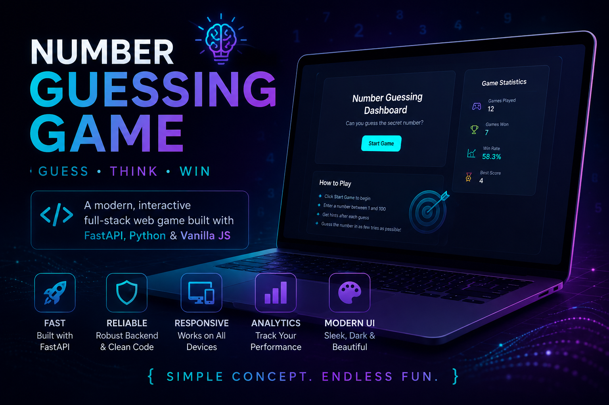
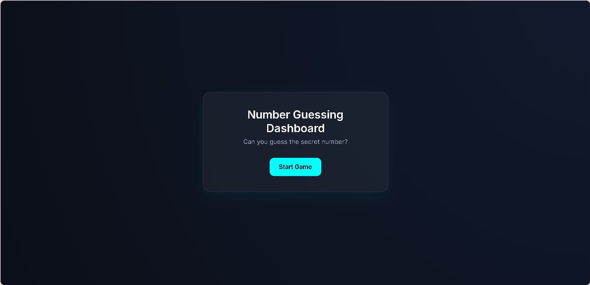

# 🎯 Number Guessing Dashboard

<p align="center">
  
</p>

<p align="center">

A modern, interactive Number Guessing Game built with **FastAPI**, **Python**, **HTML**, **CSS**, and **Vanilla JavaScript**.

Designed with a premium glassmorphism interface, responsive layout, and polished user experience.

</p>

---

## 🖥️ Dashboard Preview

<p align="center">
  
</p>

---

# ✨ Features

- 🎮 Interactive Number Guessing Game
- ⚡ FastAPI Backend
- 🎨 Modern Glassmorphism UI
- 📱 Fully Responsive Design
- ⌨️ Keyboard Accessibility
- ✨ Smooth Animations & Transitions
- 🔄 Real-Time Gameplay
- 🧩 Clean Modular Architecture
- 🛠️ Well-Structured Frontend Code
- 🚀 One-Click Launch Support

---

# 🛠️ Tech Stack

| Technology | Purpose |
|------------|---------|
| Python | Backend Logic |
| FastAPI | REST API |
| HTML5 | Structure |
| CSS3 | Styling |
| Vanilla JavaScript | Frontend Logic |

---

# 📂 Project Structure

```text
number-guessing-game/
│
├── backend/
│   ├── app.py
│   ├── game_logic.py
│   ├── requirements.txt
│   └── __init__.py
│
├── frontend/
│   ├── index.html
│   ├── style.css
│   └── script.js
│
├── screenshots/
│   ├── hero-banner.png
│   └── dashboard.png
│
├── start_game.bat
├── README.md
└── .gitignore
```

---

# 🚀 Getting Started

Clone the repository:

```bash
git clone https://github.com/Gagann-09/number-guessing-game.git
```

Move into the project:

```bash
cd number-guessing-game
```

Install dependencies:

```bash
pip install -r backend/requirements.txt
```

Run the application:

```bash
uvicorn backend.app:app --reload
```

or simply double-click:

```text
start_game.bat
```

Open:

```text
http://127.0.0.1:8000
```

---

# 🎮 Gameplay

1. Start a new game.
2. Enter a number.
3. Receive hints.
4. Continue guessing until you find the correct number.
5. Start a new round.

---

# 📸 Screenshots

| Home Screen |
|------------|
|  |

---

# 📄 License

This project is licensed under the MIT License.

---

<p align="center">

Made with ❤️ using FastAPI & Python

</p>